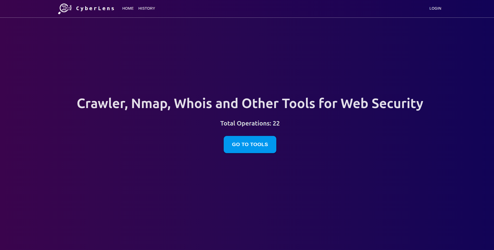

# CyberLens - Web Tabanlı Siber Güvenlik Araçları Platformu

## 📋 Proje Hakkında

CyberLens, siber güvenlik uzmanları ve araştırmacıları için geliştirilmiş web tabanlı bir platformdur. Bu platform, popüler siber güvenlik araçlarını (Nmap, Katana, Whois, Nikto) tek bir arayüzden kullanmanıza olanak tanır. React frontend ve Flask backend ile geliştirilmiş, Docker container'ları ile çalışan modern bir mimari kullanmaktadır.

## 🖼️ Arayüz Görünümü



## 🚀 Özellikler

- **Web Crawling**: Katana ile web sitesi tarama
- **Port Scanning**: Nmap ile ağ keşfi ve port taraması
- **Domain Intelligence**: Whois ile domain bilgi sorgulama
- **Kullanıcı Authentication**: Firebase ile güvenli giriş sistemi
- **Geçmiş Takibi**: Tüm işlemlerin kaydedilmesi ve görüntülenmesi
- **Real-time Results**: Celery ile asenkron görev işleme
- **Responsive Design**: Material-UI ile modern arayüz

## � Geçmiş (History) Özelliği

CyberLens platformu, gerçekleştirilen tüm tarama işlemlerini otomatik olarak kaydeder ve kullanıcıların daha sonra erişebilmesi için iki farklı yöntem sunar:

### 🔐 Kayıtlı Kullanıcılar (Firebase Authentication)

**Login olan kullanıcılar için:**
- ✅ **Kalıcı Kayıt**: Tüm tarama sonuçları Firebase kullanıcı hesabıyla ilişkilendirilir
- ✅ **Cross-Device Erişim**: Farklı cihazlardan login olarak geçmişe erişebilme
- ✅ **Uzun Dönem Saklama**: Sonuçlar hesap silinene kadar saklanır

### 🍪 Misafir Kullanıcılar (Session-Based)

**Login olmayan kullanıcılar için:**
- ⚠️ **Geçici Kayıt**: Sonuçlar sadece browser session'ında tutulur
- ⚠️ **Tek Oturum**: Pencere kapatıldığında veya sayfa yenilendiğinde kaybolur
- ⚠️ **Local Storage**: Sadece o tarayıcıda ve o sekmede erişilebilir
- ⚠️ **Sınırlı Özellikler**: Temel görüntüleme ve kısa süreli erişim


### 💡 Kullanım Önerileri

1. **Önemli Taramalar İçin**: Mutlaka login olun ki sonuçlarınızı kaybetmeyin
2. **Hızlı Testler İçin**: Misafir olarak kullanabilirsiniz ama sonuçları not alın
3. **Takım Çalışması İçin**: Her üyenin kendi hesabı olsun ki işlemler karışmasın
4. **Raporlama İçin**: Login kullanıcıları export özelliklerinden faydalanabilir

### 🔒 Güvenlik ve Gizlilik

- **Session Güvenliği**: Misafir veriler otomatik olarak temizlenir
- **Erişim Kontrolü**: Kullanıcılar sadece kendi geçmişlerini görebilir

## �🛠️ Kullanılan Teknolojiler

### Frontend
- **React 19** - Modern UI framework
- **Vite** - Hızlı build tool ve development server
- **Nginx** - Production static file serving (Alpine Linux)
- **Material-UI (MUI)** - Component library
- **TailwindCSS** - Utility-first CSS framework
- **React Router** - Client-side routing
- **Firebase Auth** - Authentication sistemi

### Backend
- **Flask** - Python web framework
- **Gunicorn** - Production WSGI server
- **Celery** - Asenkron görev kuyruğu
- **PostgreSQL** - Ana veritabanı
- **RabbitMQ** - Message broker
- **SQLAlchemy** - ORM
- **Flask-CORS** - Cross-origin resource sharing

### DevOps & Tools
- **Docker & Docker Compose** - Container orchestration
- **Multi-stage builds** - Optimized container images
- **Health checks** - Container health monitoring
- **Resource limits** - Memory ve CPU sınırları
- **Nmap** - Network discovery ve security auditing
- **Katana** - Web crawler (ProjectDiscovery)
- **Whois** - Domain information lookup
- **Flower** - Celery monitoring
- **pgAdmin** - PostgreSQL yönetimi

## 📦 Kurulum

### Gereksinimler
- Docker
- Docker Compose
- Make (opsiyonel, kolay kullanım için)

### 🚀 Hızlı Başlangıç

#### Production Environment
```bash
# Repository'yi klonlayın
git clone <repository-url>
cd s4e-staj

# Production environment'ı başlatın
make prod
# veya
docker-compose up -d

# Servisleri durdurma
make down
```

#### Development Environment
```bash
# Development environment'ı başlatın
make dev
# veya
docker-compose -f docker-compose.dev.yml up -d

# Development loglarını takip etme
make logs-dev
```

### 🔧 Manuel Kurulum

1. **Repository'yi klonlayın:**
```bash
git clone <repository-url>
cd s4e-staj
```

2. **Container'ları build edin:**
```bash
docker-compose build
```

3. **Servisleri başlatın:**
```bash
docker-compose up -d
```

## 🌐 Erişim URL'leri

### Production
- **Frontend (Nginx)**: http://localhost
- **API (Gunicorn)**: http://localhost:5000
- **Health Check**: http://localhost/api/health
- **Flower (Celery Monitoring)**: http://localhost:5555
- **PgAdmin (Database)**: http://localhost:8080
- **RabbitMQ Management**: http://localhost:15673

### Development
- **Frontend (Vite Dev Server)**: http://localhost:5173
- **API (Flask Dev Server)**: http://localhost:5000
- **Diğer servisler**: Production ile aynı portlar

## 🐳 Docker Mimarisi

### Production Setup
```
┌─────────────┐    ┌──────────────┐    ┌─────────────┐
│   Nginx     │    │  Gunicorn    │    │   Celery    │
│  (Frontend) │────│   (API)      │────│  (Worker)   │
│   Alpine    │    │ Python-slim  │    │ Python-slim │
└─────────────┘    └──────────────┘    └─────────────┘
       │                    │                   │
       └────────────────────┼───────────────────┘
                            │
              ┌─────────────┴──────────────┐
              │                            │
        ┌─────────────┐            ┌──────────────┐
        │ PostgreSQL  │            │  RabbitMQ    │
        │     DB      │            │   Broker     │
        └─────────────┘            └──────────────┘
```

### Özellikler
- **Multi-stage builds**: Küçük production image'ları
- **Non-root users**: Güvenlik için root olmayan kullanıcılar
- **Health checks**: Container sağlık kontrolü
- **Resource limits**: Bellek ve CPU sınırları
- **Restart policies**: Otomatik yeniden başlatma
- **Static file optimization**: Nginx ile gzip ve caching

## 🔄 Geliştirme vs Production

| Özellik | Development | Production |
|---------|-------------|------------|
| Frontend Server | Vite Dev Server | Nginx Alpine |
| API Server | Flask Dev Server | Gunicorn |
| Hot Reload | ✅ Evet | ❌ Hayır |
| Volume Mounting | ✅ Evet | ❌ Hayır |
| Build Optimization | ❌ Hayır | ✅ Evet |
| Health Checks | ❌ Hayır | ✅ Evet |
| Resource Limits | ❌ Hayır | ✅ Evet |

## 📊 Monitoring

### Health Checks
```bash
# API health check
curl http://localhost/api/health

# Container health status
docker-compose ps

# Detailed container inspection
docker inspect viteTailMui | grep Health -A 10
```

### Logs
```bash
# Tüm servislerin logları
docker-compose logs -f

# Belirli bir servisin logları
docker-compose logs -f frontend
docker-compose logs -f api
docker-compose logs -f worker

# Celery monitoring
# Flower: http://localhost:5555
```

## 🛡️ Güvenlik

- **Non-root containers**: Tüm servisler non-root kullanıcı ile çalışır
- **Security headers**: Nginx'de güvenlik başlıkları
- **Resource limits**: DoS ataklarına karşı koruma
- **Firebase Auth**: Güvenli kullanıcı doğrulama
- **CORS yapılandırması**: Kontrollü cross-origin erişim

## 🔧 Makefile Komutları

```bash
make help        # Kullanılabilir komutları göster
## 💡 Troubleshooting

### Yaygın Sorunlar

1. **Port çakışması**: Portların kullanımda olup olmadığını kontrol edin
2. **Firebase config hatası**: `.env` dosyasının doğru yapılandırıldığından emin olun
3. **Container başlatma hatası**: `docker-compose down -v && docker-compose up -d`
4. **Database connection error**: PostgreSQL containerının çalıştığını kontrol edin
5. **Build hatası**: `make clean` ile temizleyip tekrar build edin

### Log Kontrolü
```bash
# Tüm servislerin logları
docker-compose logs -f

# Belirli servis logları
docker-compose logs -f api
docker-compose logs -f worker
docker-compose logs -f frontend

# Health check status
docker-compose ps
```

## 🏗️ Geliştirme

### Local Development
```bash
# Development environment (hot reload aktif)
make dev

# Frontend development
cd viteTailMui
npm install
npm run dev

# Backend development  
cd api
pip install -r requirements.txt
python app.py
```

### Production Build Test
```bash
# Production build test
make prod

# Manuel build
docker-compose build
docker-compose up -d
```

## 🔮 Gelecek Planları

- [ ] Nikto vulnerability scanner entegrasyonu
- [ ] Kubernetes deployment manifests
- [ ] CI/CD pipeline (GitHub Actions)
- [ ] Advanced monitoring (Prometheus/Grafana)
- [ ] Rapor oluşturma sistemi (PDF export)
- [ ] API rate limiting
- [ ] Advanced filtering ve search
- [ ] Webhook notifications
- [ ] Scheduled scans

## 👥 Katkıda Bulunma

1. Fork edin
2. Feature branch oluşturun (`git checkout -b feature/amazing-feature`)
3. Commit edin (`git commit -m 'Add amazing feature'`)
4. Push edin (`git push origin feature/amazing-feature`)
5. Pull Request açın

## 📄 Lisans

Bu proje eğitim amaçlı geliştirilmiştir.

## 📞 İletişim

- **Geliştirici**: Melih Akman
- **Repository**: https://github.com/melih-akman/s4e-staj
- **Branch**: develop

---

⚠️ **Güvenlik Uyarısı**: Bu araçlar sadece yasal ve etik amaçlarla kullanılmalıdır. Sahip olmadığınız sistemlerde izinsiz tarama yapmayın.
